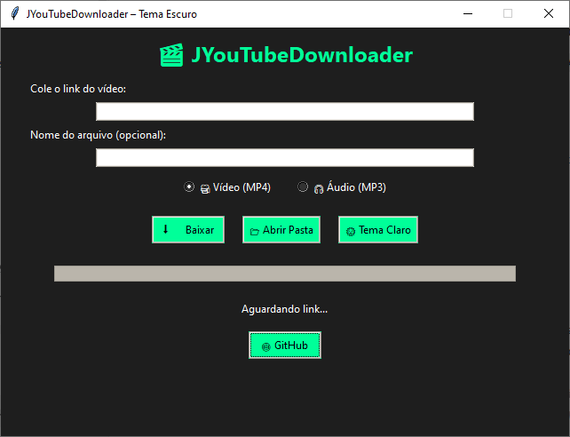

# 🎬 JYouTubeDownloader v2.0  
🎨 **Tema Escuro Neon | Interface Gráfica com Tkinter + yt-dlp + FFmpeg**

---

## 🧠 Sobre o Projeto

O **JYouTubeDownloader** é uma aplicação gráfica desenvolvida em **Python** que permite baixar vídeos e áudios do YouTube com apenas alguns cliques.  
Possui uma **interface moderna**, **tema escuro**, **campo de nome personalizado**, **botão fixo de abrir pasta**, e **detecção automática do FFmpeg**.

> 💡 Desenvolvido por **Jean Ivelsonne Dorvilma**  
> Universidade Federal da Fronteira Sul – UFFS  

---

## 🚀 Funcionalidades

✅ Interface gráfica moderna (Tkinter + ttk)  
✅ Tema escuro com verde neon (`#00ff99`)  
✅ Campo para nome personalizado do arquivo  
✅ Botão fixo **📂 Abrir Pasta**  
✅ Histórico automático de downloads (`logs/historico.txt`)  
✅ Alternância de tema (escuro ↔ claro 🌗)  
✅ Suporte a **MP4 (vídeo)** e **MP3 (áudio)**  
✅ Detecção automática do **FFmpeg**  
✅ Estrutura automática de pastas em `C:\Users\<usuário>\Videos\JYouTubeDownloader`  

---

## 🧱 Estrutura do Projeto

